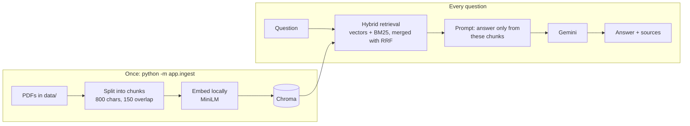

# 🎓 College Student Helpdesk (RAG)

Ask questions about **MKSSS's Cummins College of Engineering for Women** (academic calendar, brochure, placement statistics) and get answers **only from the official documents, with the file and page as source**. If the answer isn't in the documents, it says so instead of guessing.

**Live demo:** _add your Hugging Face Space link here_ &nbsp;|&nbsp; **Stack:** LangChain · ChromaDB · FastAPI · Streamlit · Gemini · Docker

> Unofficial student project, not affiliated with the college. It only uses public documents. Answers may be wrong, so check the official source for anything important.

## Why this exists
Syllabus, calendar and placement information live in separate PDFs, and the same questions keep getting asked in group chats. This project turns those PDFs into a searchable assistant that always shows where an answer came from.


## How it works



- **Ingestion:** LangChain loaders and a recursive splitter; chunks keep file name and page for citations.
- **Retrieval:** my own hybrid search (`app/retrieval.py`). Dense vector search understands meaning but is weak on exact names and numbers. BM25 keyword search is the opposite. Results are merged with Reciprocal Rank Fusion.
- **Generation:** a LangChain chain (`prompt | llm | parser`) that must answer only from the retrieved context, otherwise reply that it couldn't find the answer.
- **Serving:** FastAPI (`/ask`, `/health`) behind a Streamlit chat UI, packaged in one Docker image.


## Results

I tested retrieval and answers separately on 12 hand-written questions (10 answerable, 2 that the documents can't answer). Retrieval is measured without the LLM, so a wrong answer can be traced to search or to generation.

Retrieval mode (800-character chunks), % of questions where the right passage is in the top k, and MRR:

| Mode | hit@1 | hit@2 | hit@4 | MRR (k=4) |
|---|---|---|---|---|
| Dense (vectors only) | 50% | 80% | 100% | 0.72 |
| BM25 (keywords only) | 80% | 90% | 100% | 0.88 |
| **Hybrid (default)** | **90%** | **90%** | **100%** | **0.93** |

Chunk size (dense retrieval, hit@4): 400 chars → 90%, 800 → 100%, 1200 → 100%. Small chunks split answers across pieces.

End to end with hybrid retrieval: **12/12 answers correct**, including both out-of-scope questions being refused.

### Limitations (read before trusting these numbers)
- The test set is small and was written by me, so 100% shows the system works on these questions, not that it is flawless. The reliable result is the retrieval gain (50% → 90% hit@1).
- My questions reuse words from the documents, which favours keyword search. Paraphrased questions would be a harder, fairer test.
- Tables are flattened to text, so questions about table rows are the weakest area.
- Only three public documents; no chat memory; the free Gemini tier sometimes returns temporary 503 errors.

## Run it locally

```bash
git clone <this repo> && cd <this repo>
python3.12 -m venv venv && source venv/bin/activate
pip install -r requirements.txt
echo "GOOGLE_API_KEY=your_key" > .env        # free key from Google AI Studio
python -m app.ingest                          # builds the vector database from data/
uvicorn app.api:app --reload                  # API at http://localhost:8000/docs
streamlit run ui.py                           # chat UI at http://localhost:8501
```

Evaluate: `python eval.py --no-llm --mode hybrid --k 4` (retrieval only, free) or `python eval.py` (with Gemini).
Docker: `docker build -t helpdesk . && docker run -p 7860:7860 -e GOOGLE_API_KEY=... helpdesk`

## Project structure
```
app/ingest.py      load PDFs → chunks → embeddings → Chroma
app/retrieval.py   dense, BM25 and hybrid (RRF) search
app/rag.py         prompt + Gemini chain, returns answer and sources
app/api.py         FastAPI endpoints
ui.py              Streamlit chat UI
eval.py            retrieval vs generation evaluation (hit@k, MRR, diagnosis labels)
questions.json     test questions with expected answers and evidence
```

## Roadmap
- LangGraph router: documents vs. data questions, with chat memory and query rewriting
- Text-to-SQL on the placement table (counts, averages) with read-only guardrails
- Streaming answers and a feedback log
